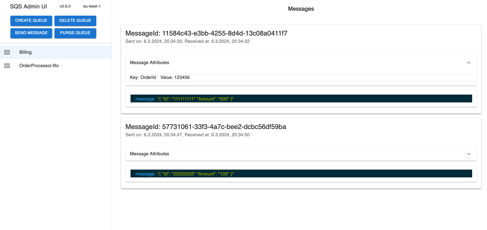

# SQS-Admin # 

A minimal and lightweight UI for managing SQS-Queues for local development e.g. with [Localstack](https://localstack.cloud/).

## Why ##
There are already good UIs for SQS, but they are heavy with sizes >100 MB. Most likely because they ship with SQS itself.
If you choose e.g. Localstack for local development you don't need an additional local SQS setup, as it is already
provided by Localstack, unfortunately without UI.
This Alpine based image has a size ~15 MB. You can easily manage and create Queues.

## Usage ##

The most common way to use SQS-Admin would be in conjunction with a ``docker-compose.yml``.
A working example can be found in the ``example`` directory.

You probably need to have a SQS up and running somewhere to connect to, e.g. via Localstack.
To start SQS-Admin simply run:
``
docker run --rm -p 3999:3999 -e SQS_ENDPOINT_URL=<Endpoint-URL-of-our-SQS> -d pacovk/sqs-admin
``

## Configuration ##

You can easily configure the Docker Container via the following environment variables:

| ENV              | Description                                                    | Default               |
|------------------|----------------------------------------------------------------|-----------------------|
| SQS_ENDPOINT_URL | **Endpoint where SQS is running, this one is mostly required** | http://localhost:4566 |
| SQS_AWS_REGION   | AWS region the client internally uses to interact with SQS     | eu-central-1          |

## Development ##

To configure the backend for local development you can set the following environment variable:

| ENV              | Description                                                    | Default               |
|------------------|----------------------------------------------------------------|-----------------------|
| HTTP_PORT        | Port that the internal backend binds to and is serving         | 3999                  |

### Legal note ### 

UI favicon by [John Sorrentino](https://favicon.io/emoji-favicons/cowboy-hat-face)